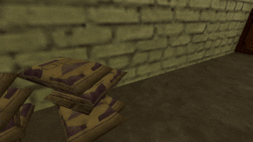

# 🫳 Entity Grab API

The **Entity Grab API** provides a flexible system for attaching, moving, and releasing entities in GoldSrc-based games. It enables developers to implement "grab and carry" mechanics, allowing players to pick up, manipulate, and throw entities with ease.

---

## 🚀 Features

- Attach any entity to a player for carrying or manipulation
- Handles entity movement, collision, and orientation automatically

---

## ⚙️ Getting Started

### 1. Attaching an Entity

To attach an entity to a player, use:

```pawn
EntityGrab_Player_AttachEntity(pPlayer, pEntity, flDistance);
```

- `pPlayer`: The player index
- `pEntity`: The entity to grab
- `flDistance`: The distance in units from the player to hold the entity

### 2. Detaching an Entity

To release the currently grabbed entity:

```pawn
EntityGrab_Player_DetachEntity(pPlayer);
```

### 3. Querying the Grabbed Entity

To get the entity currently attached to a player:

```pawn
new pGrabbedEntity = EntityGrab_Player_GetAttachedEntity(pPlayer);
if (pGrabbedEntity != FM_NULLENT) {
  // The player is holding something
}
```

---

## 🧩 Example: Implementing a Grab System



```pawn
#include <amxmodx>
#include <fakemeta>
#include <hamsandwich>
#include <xs>

#include <api_entity_grab>

#define ENTITY_PROP_CLASSNAME "prop"

new const g_szPropModel[] = "models/bag.mdl";

new g_pTrace;

public plugin_precache() {
  g_pTrace = create_tr2();

  precache_model(g_szPropModel);
}

public plugin_init() {
  register_plugin("Entity Grab System", "1.0.0", "Hedgehog Fog");

  RegisterHamPlayer(Ham_Player_PreThink, "HamHook_Player_PreThink");

  // Chat command to create test prop
  register_clcmd("say /prop", "Command_Prop");
}

public plugin_end() {
  free_tr2(g_pTrace);
}

public Command_Prop(const pPlayer) {
  static Float:vecOrigin[3]; pev(pPlayer, pev_origin, vecOrigin);
  static Float:vecAngles[3]; pev(pPlayer, pev_v_angle, vecAngles);
  static Float:vecForward[3]; angle_vector(vecAngles, ANGLEVECTOR_FORWARD, vecForward);

  static Float:vecEnd[3]; xs_vec_add_scaled(vecOrigin, vecForward, 64.0, vecEnd);

  engfunc(EngFunc_TraceLine, vecOrigin, vecEnd, DONT_IGNORE_MONSTERS, pPlayer, g_pTrace);

  new pEntity = CreateProp();
  engfunc(EngFunc_SetOrigin, pEntity, vecEnd);
}

public HamHook_Player_PreThink(const pPlayer) {
  if (!is_user_alive(pPlayer)) return HAM_IGNORED;

  static iButtons; iButtons = pev(pPlayer, pev_button);
  static iOldButtons; iOldButtons = pev(pPlayer, pev_oldbuttons);

  // Grab or release with IN_USE
  if (iButtons & IN_USE && ~iOldButtons & IN_USE) {
    static pGrabbedEntity; pGrabbedEntity = EntityGrab_Player_GetAttachedEntity(pPlayer);

    if (pGrabbedEntity == FM_NULLENT) {
      static pEntity; pEntity = @Player_FindEntityToGrab(pPlayer, 64.0);
      if (pEntity != FM_NULLENT) {
        EntityGrab_Player_AttachEntity(pPlayer, pEntity, 16.0);
      }
    } else {
      EntityGrab_Player_DetachEntity(pPlayer);  
    }
  }

  // Throw with IN_ATTACK
  if (iButtons & IN_ATTACK && ~iOldButtons & IN_ATTACK) {
    static pEntity; pEntity = EntityGrab_Player_GetAttachedEntity(pPlayer);
    if (pEntity != FM_NULLENT) {
      static Float:vecForce[3]; pev(pPlayer, pev_velocity, vecForce);
      static Float:vecDirection[3]; pev(pPlayer, pev_v_angle, vecDirection);
      angle_vector(vecDirection, ANGLEVECTOR_FORWARD, vecDirection);
      xs_vec_add_scaled(vecForce, vecDirection, 250.0, vecForce);

      EntityGrab_Player_DetachEntity(pPlayer);
      set_pev(pEntity, pev_velocity, vecForce);
    }
  }

  return HAM_HANDLED;
}

// Helper: Find an entity to grab in front of the player
@Player_FindEntityToGrab(const &this, Float:flDistance) {
  static Float:vecSrc[3]; ExecuteHamB(Ham_Player_GetGunPosition, this, vecSrc);
  static Float:vecAngles[3]; pev(this, pev_v_angle, vecAngles);

  static Float:vecEnd[3]; 
  angle_vector(vecAngles, ANGLEVECTOR_FORWARD, vecEnd);
  xs_vec_add_scaled(vecSrc, vecEnd, flDistance, vecEnd);

  engfunc(EngFunc_TraceLine, vecSrc, vecEnd, DONT_IGNORE_MONSTERS, this, g_pTrace);

  static pHit; pHit = get_tr2(g_pTrace, TR_pHit);
  
  if (pHit == FM_NULLENT) {
    engfunc(EngFunc_TraceHull, vecSrc, vecEnd, DONT_IGNORE_MONSTERS, HULL_HEAD, this, g_pTrace);
    pHit = get_tr2(g_pTrace, TR_pHit);
  }

  if (pHit == FM_NULLENT) return FM_NULLENT;
  if (!@Entity_IsProp(pHit)) return FM_NULLENT;

  return pHit;
}

@Entity_IsProp(const &this) {
  static szClassname[32]; pev(this, pev_classname, szClassname, charsmax(szClassname));

  return !!equal(szClassname, ENTITY_PROP_CLASSNAME);
}

CreateProp() {
  new pEntity = engfunc(EngFunc_CreateNamedEntity, engfunc(EngFunc_AllocString, "info_target"));
  
  set_pev(pEntity, pev_classname, ENTITY_PROP_CLASSNAME);

  dllfunc(DLLFunc_Spawn, pEntity);

  set_pev(pEntity, pev_solid, SOLID_BBOX);
  set_pev(pEntity, pev_movetype, MOVETYPE_TOSS);

  engfunc(EngFunc_SetModel, pEntity, g_szPropModel);
  engfunc(EngFunc_SetSize, pEntity, Float:{-16.0, -16.0, -4.0}, Float:{16.0, 16.0, 4.0});

  return pEntity;
}
```

---

## 📖 API Reference

See [`api_entity_grab.inc`](include/api_entity_grab.inc) for all available natives and constants.
