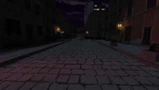

# 🥴 Player Dizziness API

The **Player Dizziness API** allows you to apply dizziness visual effects to players. This simulates disorientation by blending the player's screen, useful for drunk effects, stun mechanics, or environmental hazards.

## 📚 Usage

### Setting Dizziness

Apply dizziness to a player with a strength value between `0.0` (none) and `1.0` (maximum):

```pawn
PlayerDizziness_Set(pPlayer, 0.5); // 50% dizziness
```

### Getting Current Dizziness

```pawn
new Float:flDizziness = PlayerDizziness_Get(pPlayer);
client_print(pPlayer, print_chat, "Your dizziness: %.0f%%", flDizziness * 100);
```

### Removing Dizziness

```pawn
PlayerDizziness_Set(pPlayer, 0.0);
```

## 🧩 Example: Drinking Game



Players can drink using `/drink` command. Each drink increases dizziness by 10%. Drinking beyond 100% kills the player. Dizziness resets on respawn.

```pawn
#include <amxmodx>
#include <hamsandwich>

#include <api_player_dizziness>

new Float:g_rgflPlayerDrunkStrength[MAX_PLAYERS + 1];

public plugin_init() {
  register_plugin("Toggle Dizziness", "1.0", "Author");

  RegisterHamPlayer(Ham_Spawn, "HamHook_Player_Spawn");

  register_clcmd("say /drink", "Command_Drink");
}

public client_connect(pPlayer) {
  g_rgflPlayerDrunkStrength[pPlayer] = 0.0;
}

public Command_Drink(const pPlayer) {
  g_rgflPlayerDrunkStrength[pPlayer] += 0.1;

  PlayerDizziness_Set(pPlayer, g_rgflPlayerDrunkStrength[pPlayer]);

  if (g_rgflPlayerDrunkStrength[pPlayer] > 1.0) {
    ExecuteHamB(Ham_Killed, pPlayer, pPlayer, 0);
    client_print(pPlayer, print_chat, "You died from your excessive drinking!");
  } else {
    client_print(pPlayer, print_chat, "You are now %.0f%% drunk.", g_rgflPlayerDrunkStrength[pPlayer] * 100);
  }

  return PLUGIN_HANDLED;
}

public HamHook_Player_Spawn(pPlayer) {
  g_rgflPlayerDrunkStrength[pPlayer] = 0.0;
  PlayerDizziness_Set(pPlayer, 0.0);
}
```

---

## 📖 API Reference

See [`api_player_dizziness.inc`](include/api_player_dizziness.inc) for all available natives.
