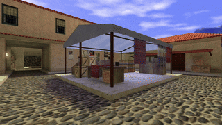

# 👁️ Player View Range API

The **Player View Range API** controls the view distance (fog) for individual players. Use it to create atmospheric environments, limit visibility for gameplay mechanics.

## 🚀 Features

- **Per-Player Fog**: Each player has independent view range
- **Dynamic Control**: Change fog distance at runtime
- **Reset Support**: Revert to the engine's default fog settings
- **Cheat Detection**: Built-in forward to detect visibility cheating
- **Change Events**: Hook into view range changes with forwards

## 📚 Usage

### Setting View Range

Set a player's view range in world units:

```pawn
PlayerViewRange_Set(pPlayer, 96.0); // Very short visibility
```

### Getting Current View Range

```pawn
new Float:flViewRange = PlayerViewRange_Get(pPlayer);
```

### Resetting to Default

Restore the engine's default fog for a player:

```pawn
PlayerViewRange_Reset(pPlayer);
```

### Forcing an Update

If the view range needs to be reapplied (e.g. after a game state change):

```pawn
PlayerViewRange_Update(pPlayer);
```

### Handling Events

React to view range changes or detect cheating:

```pawn
public PlayerViewRange_OnChange(const pPlayer, Float:flValue) {
  // View range was changed for this player
}

public PlayerViewRange_OnCheatingDetected(const pPlayer) {
  // Player attempted to bypass fog restrictions
  server_cmd("kick #%d Cheating detected", get_user_userid(pPlayer));
}
```

## 🧩 Example: Testing View Range



```pawn
#include <amxmodx>

#include <api_player_viewrange>

public plugin_init() {
  register_plugin("View Range Test", "1.0.0", "Hedgehog Fog");

  register_clcmd("say /test", "Command_Test");
}

public Command_Test(const pPlayer) {
  PlayerViewRange_Set(pPlayer, 96.0);
}
```

---

## 📖 API Reference

See [`api_player_viewrange.inc`](include/api_player_viewrange.inc) for all available natives:
